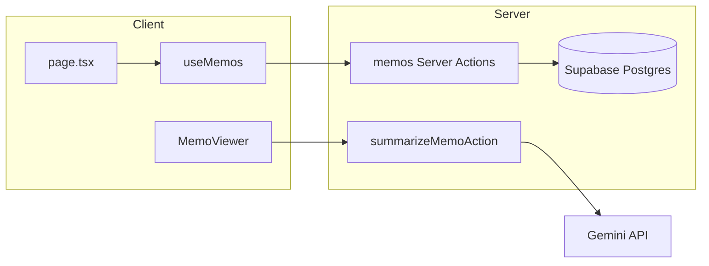

# Supabase 메모 CRUD + 서버 액션 마이그레이션 계획

## 현재 상태 요약

| 영역            | 구현 위치                                                                                                                                                                                                                                                                                                   |
| ------------- | ------------------------------------------------------------------------------------------------------------------------------------------------------------------------------------------------------------------------------------------------------------------------------------------------------- |
| 메모 CRUD·검색·필터 | `[src/hooks/useMemos.ts](c:\Users\masocampus\Desktop\memo-app-base\memo-app-base\src\hooks\useMemos.ts)` → `[src/utils/localStorage.ts](c:\Users\masocampus\Desktop\memo-app-base\memo-app-base\src\utils\localStorage.ts)`                                                                             |
| 도메인 타입        | `[src/types/memo.ts](c:\Users\masocampus\Desktop\memo-app-base\memo-app-base\src\types\memo.ts)` (`Memo`, `MemoFormData` 변경 없음)                                                                                                                                                                         |
| 샘플 시드         | `[src/utils/seedData.ts](c:\Users\masocampus\Desktop\memo-app-base\memo-app-base\src\utils\seedData.ts)` (로컬 스토리지 비어 있을 때만)                                                                                                                                                                             |
| AI 요약         | `[src/components/MemoViewer.tsx](c:\Users\masocampus\Desktop\memo-app-base\memo-app-base\src\components\MemoViewer.tsx)` → `POST` `[src/app/api/memos/summary/route.ts](c:\Users\masocampus\Desktop\memo-app-base\memo-app-base\src\app\api\memos\summary\route.ts)` (**LocalStorage 미사용**, Gemini만 사용) |

배경 이미지 등 `[backgroundStorage](c:\Users\masocampus\Desktop\memo-app-base\memo-app-base\src\utils\backgroundStorage.ts)`는 범위 밖으로 유지합니다.

## 1. DB 스키마 (타입 정합)

`[Memo](c:\Users\masocampus\Desktop\memo-app-base\memo-app-base\src\types\memo.ts)` 필드와 1:1 대응:

- `id` → `uuid` PK (앱 규칙: 생성 시 `uuid` v4 사용 — insert 시 클라이언트/서버에서 `uuid` 패키지로 생성해 넣거나, DB `gen_random_uuid()` 사용 시 v4와 동등)
- `title`, `content`, `category` → `text` / `not null`
- `tags` → `text[]` (빈 배열 기본값)
- `createdAt`, `updatedAt` → `timestamptz`, DB 컬럼명은 `created_at`, `updated_at` (표준 snake_case)

**Supabase MCP**: ACT 단계에서 `apply_migration`으로 DDL 적용 (예: 마이그레이션 이름 `create_memos_table`). 내용에 포함할 것:

- `public.memos` 테이블 생성
- `updated_at` 자동 갱신 트리거(선택, 삽입/수정 시 일관성)
- RLS: 데모 단일 사용자 기준으로는 `**SUPABASE_SERVICE_ROLE_KEY`는 서버에서만 사용**하고 RLS는 `anon`에 대해 막거나, 서비스 롤이면 RLS 우회로 CRUD 단순화 — 문서에 “프로덕션에서는 인증·RLS 정책 필요” 한 줄 명시

목업 시드는 별도 `execute_sql` 또는 두 번째 `apply_migration`으로 `INSERT` (고정 UUID 권장: 기존 `sampleMemos`의 `'1'`, `'2'` 등은 UUID가 아니므로 `**uuid` v4로 교체**해 골든룰과 DB 타입을 맞춤).

## 2. 환경 변수

`[\.env.example](c:\Users\masocampus\Desktop\memo-app-base\memo-app-base\.env.example)`에 예시 추가:

- `NEXT_PUBLIC_SUPABASE_URL` — Supabase 프로젝트 URL (필요 시 공개 가능)
- `SUPABASE_SERVICE_ROLE_KEY` — **서버 전용**, Server Actions 전용 클라이언트에만 사용 (브라우저 번들 금지)

기존 `GEMINI_API_KEY` 유지 (요약·태그 제안용).

로컬은 사용자가 `.env.local`에 직접 채움. MCP `[get_project_url](file:///C:/Users/masocampus/.cursor/projects/c-Users-masocampus-Desktop-memo-app-base-memo-app-base/mcps/project-0-memo-app-base-supabase/tools/get_project_url.json)` / `[get_publishable_keys](file:///C:/Users/masocampus/.cursor/projects/c-Users-masocampus-Desktop-memo-app-base-memo-app-base/mcps/project-0-memo-app-base-supabase/tools/get_publishable_keys.json)`는 연동 프로젝트가 있을 때 참고용(anon은 RLS 정책에 따라 대안 가능).

## 3. 의존성 및 Supabase 클라이언트

- `package.json`에 `@supabase/supabase-js` 추가
- 신규 예: `[src/lib/supabase/server.ts](c:\Users\masocampus\Desktop\memo-app-base\memo-app-base\src\lib\supabase\server.ts)`에서 `createClient(url, serviceRoleKey)` 단일 팩토리 (환경 변수 누락 시 명시적 에러)

## 4. Server Actions (메모 CRUD)

신규 파일 예: `[src/app/actions/memos.ts](c:\Users\masocampus\Desktop\memo-app-base\memo-app-base\src\app\actions\memos.ts)` (`'use server'`)

- `getMemos(): Promise<Memo[]>` — `select * order by updated_at desc`
- `createMemo(form: MemoFormData): Promise<Memo>` — `uuid` v4로 `id` 생성, `insert`, 반환 타입은 기존 `Memo`
- `updateMemo(id, form): Promise<void | Memo>`
- `deleteMemo(id)`, `clearAllMemos()`

**행 매핑**: DB `snake_case` ↔ 앱 `Memo`(camelCase, ISO 문자열) 유틸을 같은 파일 또는 `src/utils/memoDb.ts`에 집약해 중복 방지.

Supabase 에러는 `ActionResult` 패턴(`{ ok, error }`) 또는 throw 중 하나로 통일해 훅에서 처리.

## 5. `useMemos` 리팩터

`[src/hooks/useMemos.ts](c:\Users\masocampus\Desktop\memo-app-base\memo-app-base\src\hooks\useMemos.ts)`:

- 마운트 시 `getMemos()`로 로드 (`seedSampleData` / `localStorageUtils` **제거**)
- `createMemo` / `updateMemo` / `deleteMemo` / `clearAllMemos`에서 해당 Server Action `await` 후 상태 갱신(또는 전체 refetch로 단순화)
- 검색·카테고리·`stats`는 기존처럼 클라이언트 `useMemo` 유지 가능(전량 로드 가정). 데이터가 커지면 나중에 서버 필터로 확장.

## 6. 목업 데이터

- `[src/utils/seedData.ts](c:\Users\masocampus\Desktop\memo-app-base\memo-app-base\src\utils\seedData.ts)`: 런타임 시드 제거 또는 “개발용 Server Action `seedDevMemos`”로만 제한(프로덕션 비노출). **권장**: MCP `execute_sql`로 초기 6건 INSERT + README성 주석만 코드에 남기기
- 샘플 `id`를 모두 유효한 UUID로 바꿔 문서/스크립트와 타입 일치

## 7. 요약 기능 (Supabase와의 관계)

요약은 **DB 마이그레이션 대상이 아님**. 다만 “서버 액션 활용”에 맞추려면:

- `[route.ts](c:\Users\masocampus\Desktop\memo-app-base\memo-app-base\src\app\api\memos\summary\route.ts)`의 Gemini 호출 로직을 `**summarizeMemoAction(title, content)`**로 추출하고 `[MemoViewer](c:\Users\masocampus\Desktop\memo-app-base\memo-app-base\src\components\MemoViewer.tsx)`는 `fetch` 대신 해당 액션 호출
- 선택: 공통 모듈 `src/lib/gemini/summary.ts`로 프롬프트·모델 상수 공유

태그 제안(`[api/memos/tags/route.ts](c:\Users\masocampus\Desktop\memo-app-base\memo-app-base\src\app\api\memos\tags\route.ts)`)도 동일 패턴으로 옮길 수 있음 — **필수는 아니며**, 일관성 원하면 같은 패치에 포함 가능.

## 8. 정리·검증

- 메모 전용 `localStorage.ts` 사용처 제거 여부 확인 후, 미사용 시 파일 삭제 또는 주석으로 deprecated
- `npm run lint`, `npm run build`
- (선택) Playwright가 있다면 로컬 스토리지 기대 제거

## 데이터 흐름 (마이그레이션 후)

## 리스크 및 전제

- **Service Role**: 현재 앱은 인증 없음 → 서버 액션만이 DB 보호층. 배포 시 엔드포인트 노출 범위와 Rate limit 고려.
- **멀티 유저**: 테이블에 `user_id` 없음 — 기존 단일 버킷 LocalStorage와 동일한 제품 가정.

